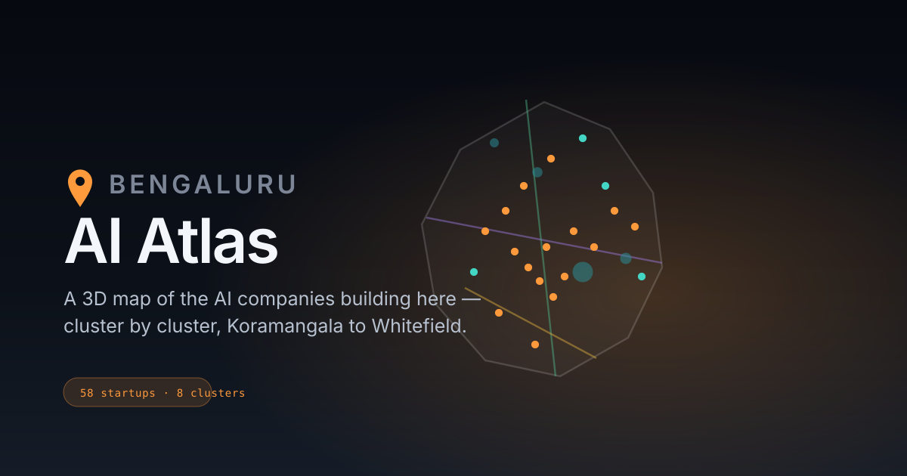

# Bengaluru AI Atlas

A high-fidelity 3D interactive map of Bengaluru's AI companies, cluster by
cluster — from the founder cafés of Koramangala to the campus city of
Whitefield. Inspired by (and structurally modelled on)
[NYC AI Atlas](https://www.nycaiatlas.com/).

**58 companies · 8 clusters · one plateau.**



## Running it

```bash
npm install
npm run dev        # dev server
npm run build      # production build → dist/
npm run preview    # serve the production build
```

## How to use the map

| Input | Action |
| --- | --- |
| Drag | Orbit the camera |
| Shift-drag / right-drag | Pan across the board |
| Scroll / pinch | Zoom |
| `↑` `↓` | Step through clusters |
| `←` `→` | Rotate the view |
| `⌘K` or `/` | Search companies by name, sector, or cluster |
| Click a pin | Open the company card and fly to it |
| `Esc` | Close the company card |
| ☀ / ☾ button | Switch between the night map and the paper map |

## Themes

Two full treatments, not a CSS filter: **dark** is the city at night (glowing
pins, emissive metro lines), **light** is a paper map (ink roads on cream,
deeper pin colours so the dots keep contrast). The atlas follows your OS
preference by default; the toggle overrides it and remembers the choice
(`localStorage`, key `atlas-theme`). The 3D board, HUD, labels and mini-map all
swap together — palettes live in `PALETTES` (`src/city.js`), lighting in
`SCENE_THEMES` (`src/scene.js`), interface tokens in `src/tokens.css`.

## What's on the board

- **Pins** — one per company. Saffron = headquarters, teal = satellite or
  research office. Pins in the active cluster glow; the rest dim.
- **Geography** — the Outer Ring Road, the arterials (Hosur, Sarjapur, Bellary,
  Old Airport Road…), all three Namma Metro lines, the lake chain from Hebbal
  to Bellandur–Varthur, Cubbon Park and Lalbagh, and landmark structures
  (Vidhana Soudha, UB City, ITPL, Manyata, IISc…).
- **Buildings** — procedurally scattered inside hand-drawn district polygons,
  deterministic across loads, denser and taller in the tech cores.
- **Traffic** — ~280 cars, scooters and auto-rickshaws running along the road
  network, keeping left, two lanes a side on the ORR. Moving lights at night,
  painted bodies by day; scooters weave, autos dawdle. Parks itself for
  `prefers-reduced-motion` users.

The geography is **stylized, not GIS-precise** — drawn the way a transit
diagram is drawn, to be legible at map scale. Company pins are placed at
neighbourhood level, not surveyed rooftops.

## Architecture

No framework, no map SDK, no backend. Vite + three.js + vanilla JS modules.

| File | Responsibility |
| --- | --- |
| `src/data.js` | The dataset: clusters (`AREAS`) and companies (`STARTUPS`) |
| `src/geo.js` | Hand-authored geography: lakes, parks, roads, metro, districts, landmarks. Plus the lat/lng → world projection |
| `src/geometry.js` | Pure math: PRNG, point-in-polygon, road corridors, easing |
| `src/city.js` | Turns geography into meshes; procedural buildings |
| `src/pins.js` | Company pins, hover/selection animation, screen-space sizing |
| `src/traffic.js` | Ambient vehicles along the road polylines |
| `src/labels.js` | HTML label layer with collision-avoiding placement |
| `src/scene.js` | Renderer, lighting, and the orbital camera rig with flights |
| `src/main.js` | HUD, search, mini-map, interaction wiring |
| `src/tokens.css` | Design tokens |
| `src/styles.css` | Interface styles |

Everything positional is stored as WGS84 lat/lng and projected at load, so
adding a company or moving a lake is a coordinate edit, not a scene edit.

## Adding your startup

See [CONTRIBUTING.md](CONTRIBUTING.md) — it's a single record in
`src/data.js`.

## Data

Compiled August 2026 from public sources: company sites, funding announcements
and press. Corrections welcome via PR.
